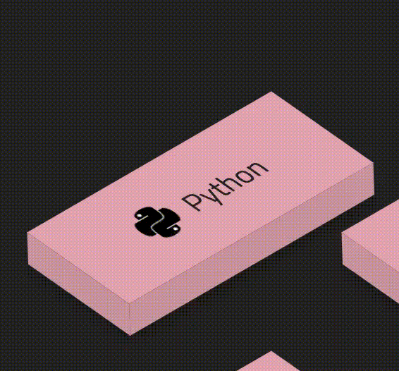

# Personal Site Assets

> Assets of my personal website

[](https://www.npmjs.com/package/@tristan2000/personalsite-assets) [](https://standardjs.com)

## Demos

### 1. Button3D



### 2. Dropdown


### 3. FlipCard

   

## Install

```bash
npm i @tristan2000/personalsite-assets
```

## Usage

```jsx
import React, { useState } from 'react'
import { FlipCard, Dropdown, Button3D } from '@tristan2000/personalsite-assets'
import './App.css'

function App() {
  const [open, setOpen] = useState(true)
  const [value, setValue] = useState('')

  const handleSelect = (selected) => {
    alert(selected)
  }

  const handleClose = () => {
    setOpen(false)
  }

  return (
    <div className='App'>
      <Dropdown
        items={['1', '2', '3']}
        open={open}
        orgin={'top'} // or "bottom"
        onSelect={handleSelect}
        onClose={handleClose}
      ></Dropdown>

      <Button3D logo='logo192.png' text='some text'></Button3D>

      <FlipCard
        title='title'
        description='description'
        image='logo192.png'
      ></FlipCard>
    </div>
  )
}

export default App
```

## License

MIT © [Tristan816la](https://github.com/Tristan816la)
